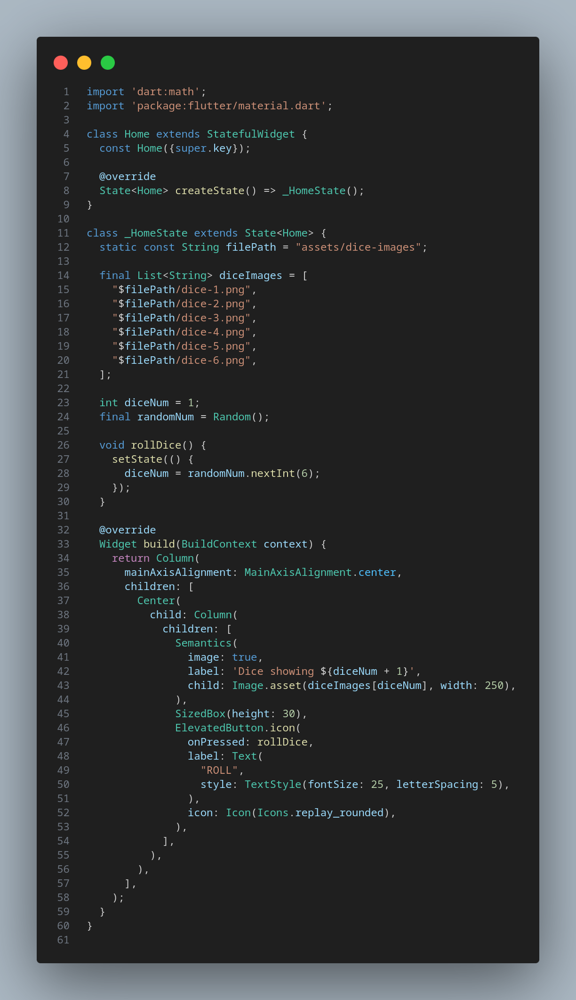

# 🎯 Welcome to My Flutter Learning Journey!


This repository contains all my work from **"Flutter & Dart - The Complete Guide [2025 Edition]"**, including:  
👉 Course projects  
👉 My improved versions  
👉 Notes & additional learning resources  

---

## 📂 **Folder Structure**  

```bash
flutter-course-2025/
├── 💁️ course_projects/              # Original course projects
│   ├── 📂 course_roll_dice_app/         
│
├── 💁️ my_projects/                  # My own customized versions  
│   ├── 📂 my_roll_dice_app/          
│
├── 💁️ assets/                       # Images, videos & extra resources  
├── 📄 README.md                     # Main repo documentation  
├── 📄 .gitignore                     # Ignore unnecessary files  
```

---

## 🎥 **Course vs. My Version (Side-by-Side Comparison)**  

| 📌 Course Version Roll Dice App Home | ✨ My Version Roll Dice App Home | 
|------------------|--------------|
|  |  |

## 📌 Comparison with Course Version (roll dice app)

- **Image Path Management**:
  - **Course Version**: Requires image filenames to follow a numerical pattern (e.g., `dice-1.png`, `dice-2.png`).
  - **My Version**: Uses a list to store image paths, allowing for any filenames and improving maintainability.

- **Accessibility**:
  - **Course Version**: Lacks accessibility features.
  - **My Version**: Includes the `Semantics` widget to provide screen reader support, making the app more inclusive.

---

## 📚 **Additional Learning Resources**  

📚 **Official Docs:**  
- [Flutter Official Docs](https://flutter.dev/docs)  
- [Dart Programming Docs](https://dart.dev/)  
- [Flutter Packages (Pub.dev)](https://pub.dev/)  

🎥 **Video Tutorials:**  
- [Flutter & Dart - The Complete Guide [2025 Edition]](https://www.udemy.com/course/learn-flutter-dart-to-build-ios-android-apps)  
- [Dart for Beginners - YouTube](https://www.youtube.com/watch?v=Fqcsow_7go4)  

---